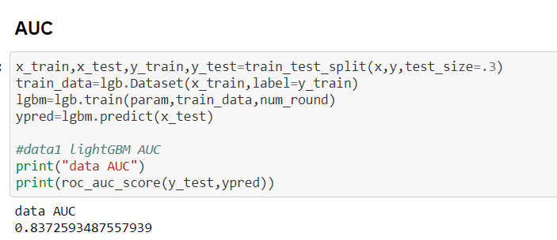
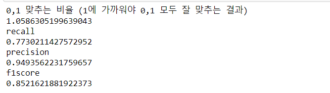
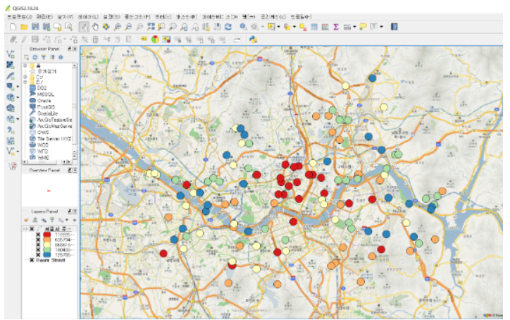

# seoul-bigdata-competition

 
2020 seoul bigdata competition

## Topic

Due to COVID-19, outdoor sports facilities are crowded and being closed.

So I made prioritize through analysis

## Data Sources

- 전국공공체육시설

  https://www.culture.go.kr/bigdata/user/data_market/agency/detail.do?id=kspo_org

- 서울시 인구 데이터 현황

  http://kosis.kr/statHtml/statHtml.do?orgId=101&tblId=INH_1B04005N_11&vw_cd=MT_ZTITLE&list_id=201_20103&seqNo=&lang_mode=ko&language=kor&obj_var_id=&itm_id=&conn_path=MT_ZTITLE

## Environment
- python3
- LightGBM

## Installation
```
$ pip install lightgbm
```

Clone Repository...

```sh
$ mkdir project
$ cd project
$ git clone https://github.com/DongChanKIM2/seoul-bigdata-competition.git
$ cd seoul-bigdata-competition
```

## Results

This is the priority of outdoor sports facilities in Seoul









## FeedBack

Although this ranked in the top of 20th, but I failed to win the award

I think there are two reasons.

First, there was no floating population data to use, so I used the gym facilities data to dependent variable.

Secondly, the judges gave the comments that I've did not inspection on-site

I'll make up these shortages to produce better result for next time

## License
Copyright © 2020 [Chan](https://github.com/DongChanKIM2)  
MIT
